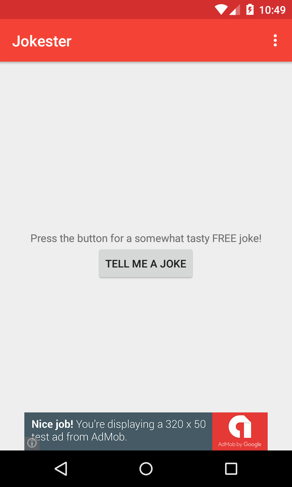
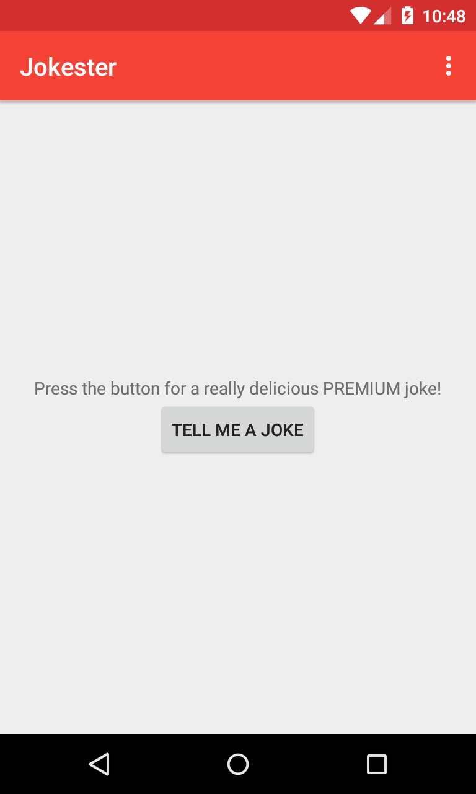
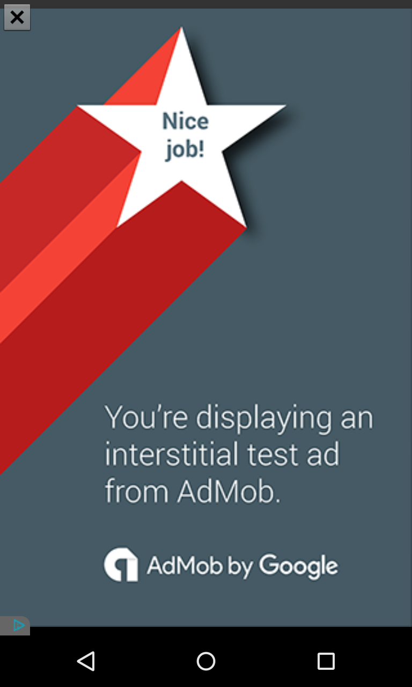
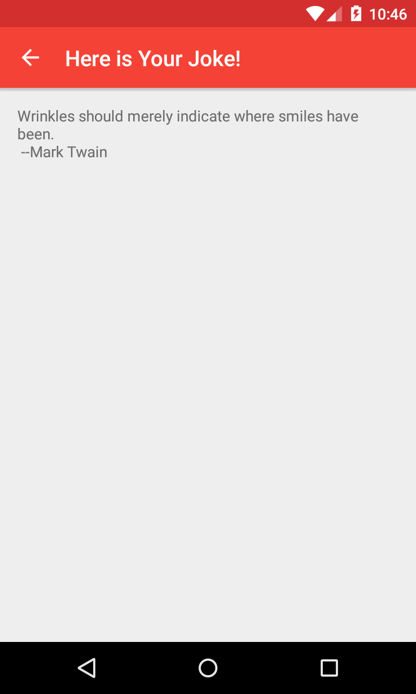

# Jokester
Udacity Nanodegree P5-Build-it-Bigger

## Synopsis

This repository contains **Jokester**, a joke-telling app I modified for Udacity Android Developer Nanodegree Project 4: Build-it-Bigger.

## Feature Summary

Material Design, FREE and PAID flavors, AdMod integration, Java library, Android library, backend Google Cloud Endpoints module (can run locally, or live on Google App Engine), Android unit tests.

## Features

The original app comprised an activity with a banner ad and a button that purported to tell a joke, but just showed a toast message.  It did not offer any of the advanced features listed below.  I modified and redesigned designed it to meet all of the requirements as per Udacity's rubric for P4.  Features may or may not be completed and include, but are not limited to:

Material Design conforms to Google's latest UI/UX standards. 

Features Google's latest Material AppCompat and Design library widgets.

FREE version interfaces with AdMob for presenting banner on the home screen and presents an interstitial ad after user clicks "Tell Me a Joke" button and before joke is displayed.

PAID version does not show any ads.

A Java library provides two types of jokes, good ones and bad ones (anti-jokes), which are requested by the PAID and FREE versions respectively.

An Android library provides an activity for displaying jokes.  

A backend server retrieves jokes from the Java library and passes them to the Android library for display.

## Screenshots

 

  

## build.gradle

    compile fileTree(dir: 'libs', include: ['*.jar'])
    compile project(':jokeactivitylib')
    compile 'com.android.support:appcompat-v7:23.1.1'
    compile 'com.android.support:design:23.1.1'
    compile 'com.google.android.gms:play-services-ads:8.4.0'
    compile project(path: ':backend', configuration: 'android-endpoints')
  

## Icon 

http://www.iconarchive.com/show/free-large-love-icons-by-aha-soft/Smile-icon.html

## Testing

This project has been tested on:

* Samsung Tab 4 running Android 4.4.2
* GenyMotion emulator running Android 5.1

			
## Installation

You can fork this repo or clone it using `git clone https://github.com/jheske/jokester.git`

## Contributors

Jill Heske, Udacity Discussion Forums

## License

See LICENSE file at top level of repo.